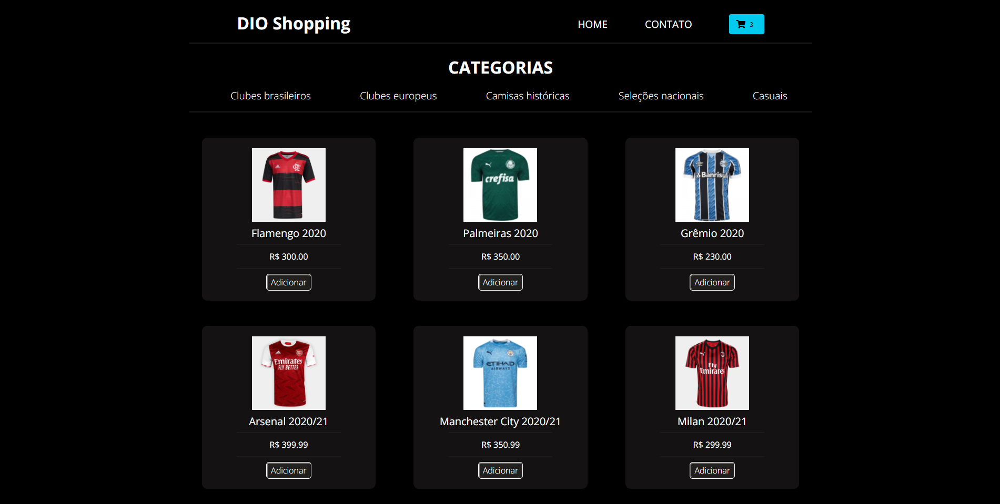
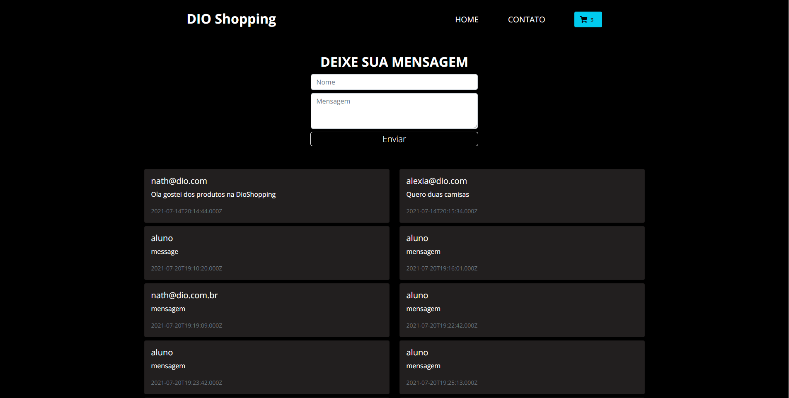

# DIO Shopping 

Esse projeto foi feito durante o BootCamp Inter FrontEnd Developer

## Requisitos

Para que o projeto funcione, é necessário que o app seja iniciado na porta 3000 e a API da loja na porta 5000.

[Link para o Repositório da API](https://github.com/Gustavogbd/api-dioshopping) 

### Status do Projeto
Projeto finalizado, trabalhando no deploy da aplicação.

### `npm start`

Runs the app in the development mode.\
Open [http://localhost:3000](http://localhost:3000) to view it in the browser.

The page will reload if you make edits.\
You will also see any lint errors in the console.

